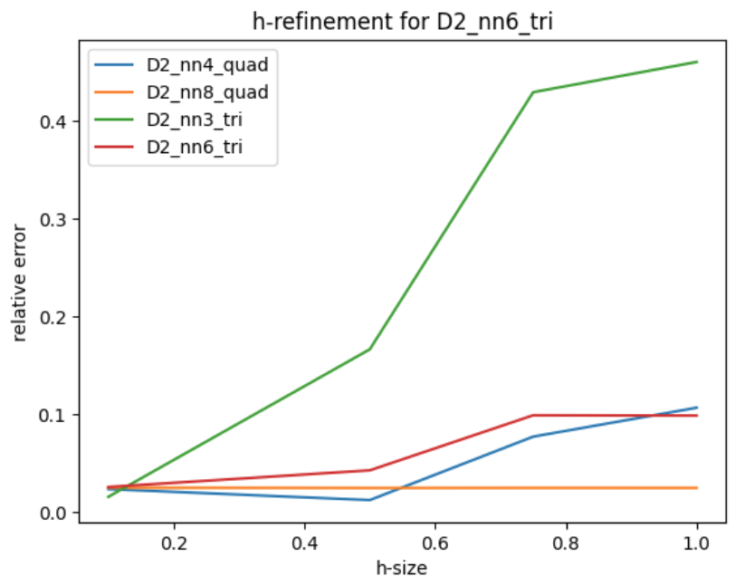

# finite-element-analysis

[](https://www.python.org/)

[](https://github.com/sandialabs/sibl#license)

[](https://codecov.io/gh/Lejeune-Lab-Graduate-Course-Materials/finite-element-analysis)
[](https://github.com/Lejeune-Lab-Graduate-Course-Materials/finite-element-analysis/actions)
### Assignment 3-4
[tutorials/partA.ipynb](tutorials/partA.ipynb)

Here I have compared the analytical solution and the FEM analysis of a simply supported beam under distributed load

[tutorials/partB.ipynb](tutorials/partB.ipynb)

In this tutorial I have done the h-refinement and p-refinement on the same problem but with large deformation.


[tutorials/partC.py](tutorials/partC.py)

In this example I tried to implement an example of applying a point force on the face of the element of a beam to simulate a clamped beam under a point load. Here I am expecting the FEM to be very sensitive to the mesh size. Work in progress.

### Code overview
This overview is based on the toy example code 1 in tutorials.
The high-level overview of the function calls and inputs using the toy example `tutorials/full_code_example_1.py` as the entry point.

And the overview diagram of the solver function can be seen in:

### Conda environment, install, and testing

Note: this is an extremely minimalist readme, but the code is highly documented and will get built out over the coures of assignment 3.

```bash
conda create --name finite-element-analysis-env python=3.12.9
```

```bash
conda activate finite-element-analysis-env
```

```bash
python --version
```

```bash
pip install --upgrade pip setuptools wheel
```

```bash
pip install -e .
```

```bash
pytest -v --cov=finiteelementanalysis --cov-report term-missing
```
## Find the tutorial home work in tutorials directory under the name of `tutorial_hw.ipynb`